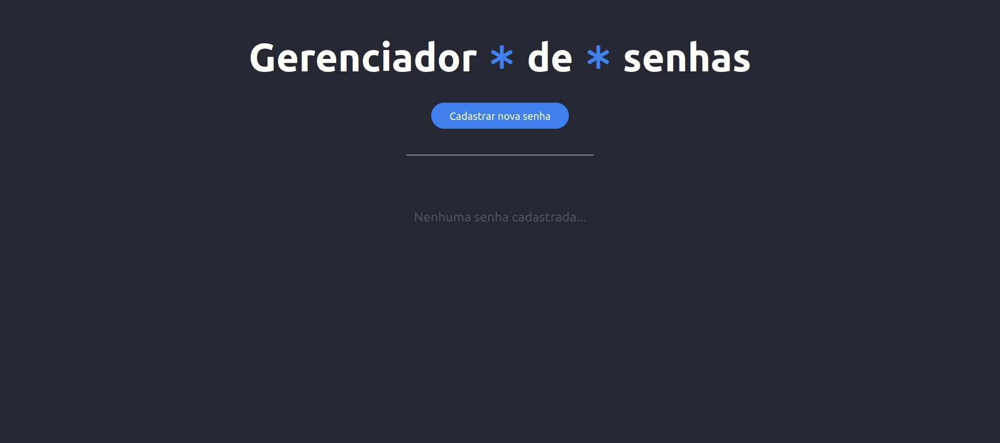

# 🔒📂 Gerenciador de Senhas - React, TypeScript e Tailwind
Este é um projeto de um Gerenciador de Senhas desenvolvido com React e TypeScript, no qual uma pessoa usuária pode cadastrar senhas para serviços que ela utiliza na internet, visualizar as senhas cadastradas e as informações do serviço, esconder as senhas salvas e remover os dados armazenado.

## ✅ Funcionalidades Implementadas
### 📋 Cadastro de Senhas:
Os usuários podem adicionar senhas para serviços online, fornecendo o nome do serviço, login, senha e URL correspondente. Para habilitar o botão de cadastro, a senha deve seguir as seguintes regras: ter no mínimo 8 e no máximo 16 caracteres e conter letras, números e algum caractere especial. 

### ❗ Alerta de cadastro:
Ao cadastrar um novo serviço corretamente, é exibido um alerta da biblioteca `SweetAlert` informando à pessoa usuária que um novo serviço foi cadastrado com sucesso.

### 👁️ Visualização e Ocultação de Senhas:
As senhas cadastradas podem ser visualizadas ou ocultadas usando um checkbox específico. Ao marcar o checkbox "Esconder senhas", as senhas serão ocultadas.

### ❌ Remoção de Senhas:
Os usuários podem remover senhas cadastradas individualmente, utilizando o botão "Remover" associado a cada serviço.

## 💡 Componentes
1. `Header.ts`
- Elemento de cabeçalho que contém informações sobre a aplicação.

2. `Form.ts`
- Componente que permite aos usuários cadastrar novas senhas.
- Inicialmente, exibe um botão "Cadastrar nova senha".
- Ao clicar no botão, o formulário para cadastrar a senha é exibido, e o botão desaparece.
- Verifica se os campos estão preenchidos corretamente antes de permitir o cadastro.
- Mensagens de validação são exibidas ao lado dos campos.

3. `Services.ts`
- Lista os serviços cadastrados.
- Ao cadastrar um novo serviço, exibe o nome do serviço como um link para a URL cadastrada, o login e a senha.
- Possui um botão de "Remover" para cada serviço cadastrado.

## 💻 Visualize este projeto:

Acesse a página aqui: [geovannaotoni-password-manager.surge.sh](https://geovannaotoni-password-manager.surge.sh/)

## 🔧 Instruções de Uso
1. Clone o repositório.
2. Instale as dependências utilizando `npm install`.
3. Execute o projeto com `npm start`.
4. Interaja com a aplicação para cadastrar, visualizar, ocultar e remover senhas.

## ℹ️ Considerações finais
Este projeto é apenas para fins educacionais. Qualquer dúvida ou sugestão, sinta-se à vontade para entrar em contato.
